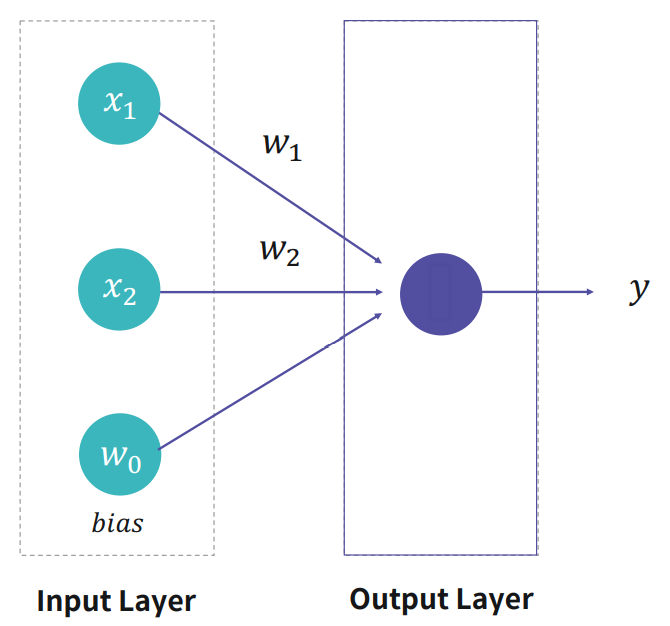
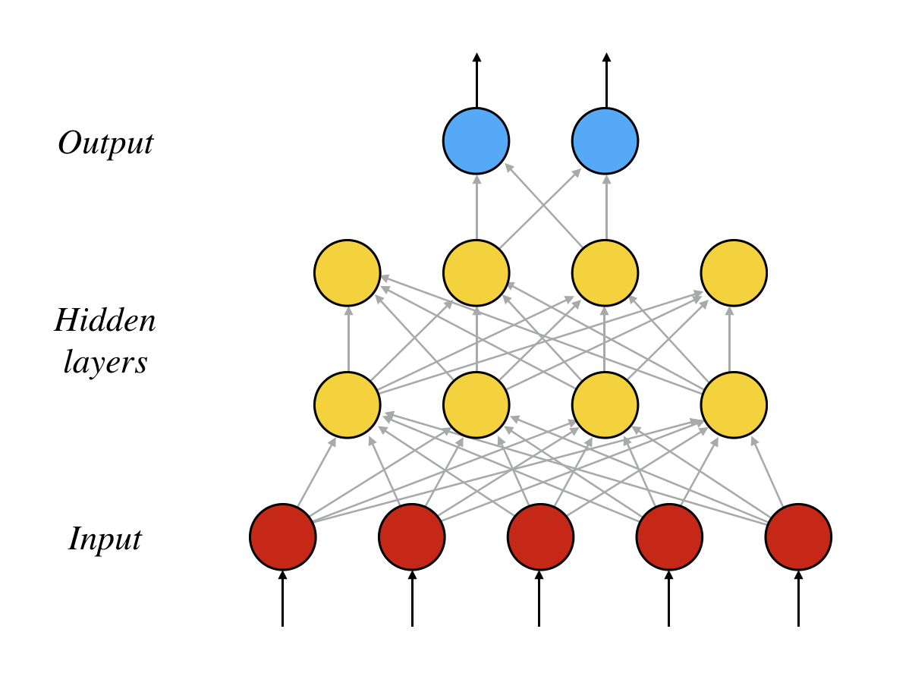

## 22.05.11

<br>

### 0. 딥러닝 개론

인공신경망에 기반하여 컴퓨터에게 사람의 사고방식을 가르치는 방법

### 1. 퍼셉트론 (Perceptron)

- 활성화 함수 (Activation function)

* 코드 예시

```py
def perceptron(x, weights):
    # bias
    sum_ = weights[0]
    for i in range(len(x)-1):
        pre_y += weights[i+1] * x[i]
    return 1 if pre_y >= 0 else 0
```

### 2. 퍼셉트론 선형 분류기

- 단층 퍼셉트론(Single Layer Perceptron)

  

  - 입력층 (Input Layer): 외부로부터 데이터를 입력받는 신경망 출구의 Layer

  - 출력층 (Output Layer): 모델의 최종 연산 결과를 내보내는 신경망 출구의 Layer

### 3. 비 선형적인 문제

- XOR 문제

: XOR 문제는 주어진 두 x1, x2의 값이 다르면 결과가 1이 나오고 같으면 0이 나오는 문제

### 4. 다층 퍼셉트론 (MLP)


