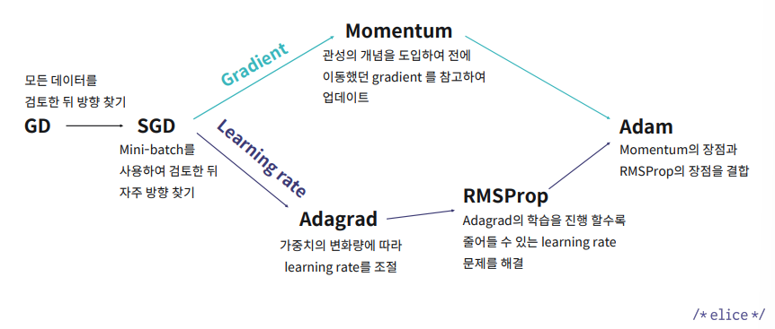
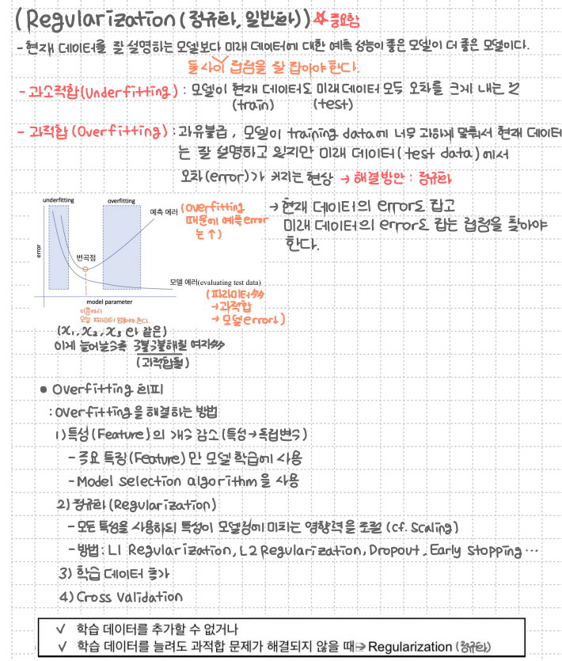

## 22.05.14

## 딥러닝 모델 학습의 문제점

### 1. 학습 속도 문제

- 원인: 전체 학습 데이터 셋을 사용하여 손실 함수를 계산하기 때문에 계산량이 너무 많아짐.

- 해결 방법: 전체 데이터가 아닌 부분 데이터만 활용하여 손실 함수를 계산하자.
  **SGD(Stochastic Gradient Descent)**

  - 미니 배치(mini-batch)에 대해서만 손실 함수를 계산

- 최적화 알고리즘
  1. `Momentum` : 과거에 이동했던 방식을 기억하면서 그 방향으로 일정 정도를 추가적으로 이동하는 방식
  2. `AdaGrad(Adaptive Gradient)` : 많이 변화하지 않은 변수들은 Learning rate를 크게 하고, 많이 변화했던 변수들은 Learning rate를 작게 하는 것
  3. `RMSProp` : 과거의 기울기는 잊고 새로운 기울기 정보를 크게 반영
  4. `Adam` : Momentum + RMSProp

* 요약

 

### 2. 기울기 소실 문제

- 기울기가 0인 값을 전달하며 중간 전달값이 사라지는 문제

- 해결 방법: 활성화 함 (Activation Function) 방식 변화
  - ReLU, Tanh
  - 내부 Hidden Layer에는 ReLU를 적용하고 Output Layer에서만 Tanh를 적용

 

### 3. 초기값 설정 문제

활성화 함수의 입력 값이 너무 커지거나 작아지지 않게 만들어주려는 것이 핵심.

 

### 4. 과적합 문제

1. 정규화(Regularization)
   - L1 정규화(Lasso Regularization) : 가중치의 절댓값의 합을 규제 항으로 정의
   - L2 정규화(Ridge Regularization) : 가중치의 제곱의 합을 규제항으로 정의

2. 드롭아웃(Dropout)
   - 각 layer마다 일정 비율의 뉴런을 임의로 drop시켜 나머지 뉴런들만 학습하는 방법
3. 배치 정규화(Batch Normalization)
   - 매 Layer마다 정규화를 진행하므로 가중치 초기값에 크게 의존하지 않음(초기화 중요도 감소)
