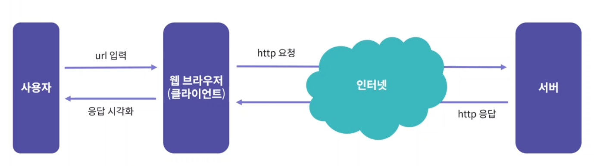

## 22.02.18
* Express.js


### 1) 웹 서비스 동작 방식
* HTTP 요청: 사용자가 어떤 데이터가 필요한지 서버에게 알리는 역할
* HTTP 응답: HTTP 요청에 해당하는 적절한 데이터를 전달하는 역할



<br>

#### < 백엔드와 프론트 엔드>

* 백엔드: 사용자에게 보이지 않는 데이터 가공 등의 기능을 주로 담당 = 서버
* 프론트엔드: 사용자가 직접 사용하게 되는 웹 페이지를 주로 담당 = 클라이언트

#### < CSR > 프론트엔드
client-side rendering
- 서버와 API 통신으로 데이터만 주고 받음.

#### < SSR > 백엔드
server-side rendering

<br>

### 2) 웹 프레임워크
웹 서비스에 필요한 기능들을 제공해주는 다양한 도구들의 모임

#### < 라우팅 >
- http 요청을 분기하는 방법 제공
- http 요청에 따라 알맞은 응답을 보내주는 경로를 설정해주는 일

#### < Node.js의 웹 프레임워크 >
1. **Express.js** : Node.js의 가장 유명한 웹 프레임워크
2. Nest.js : TypeScript를 사용하며, 고정된 구조를 제공하는 웹 프레임워크

<br>

### 3) Express.js
: 다양한 미들웨어를 통해 필요한 기능을 간단하게 추가 가능


#### < 1. 처음부터 작성하는 방법 >
직접 모든 구조를 작성해야함.

```yarn init``` ```/ npm init```<br>
```yarn add express``` ```/ npm i express```

```js
const express = require('express')
const app = express()

app.get('/', (req, res) => {
    res.send('Hello World!');
});

app.listen(3000, () => {
    console.log('Server Started');
});
```

#### < 2. Express-generator로 express.js 시작 >

\- 프로젝트의 기본구조를 자동으로 생성<br>
\- 빠르게 프로젝트를 시작하기 좋은 방법<br>
\- npm start 로 실행 가능<br>

* ```npm i -g express-generator```
* ```express my-server```<br>
my-server 디렉토리 생성, 하위에 다양한 폴더와 파일 생성<br>
* ```cd my-server```<br>
* ```npm i```<br>
* ```npm start```

( 설치 없이 쓰는 방법 )
* ```npx express-generator my-web```
* ```cd my-web```<br>
* ```npm i```<br>
* ```npm start```

<br>

#### < Express-generator로 생성한 express.js 구조 >

* my_web
    * app.js: Express.js의 가장 기본이 되는 파일
    * package.json: 프로젝트 의존성 및 스크립트 정의
    * routes: 라우팅 파일 디렉토리
    * views: HTML Template 디렉토리
    
<br>

### 4) Express.js 동작 방식
### < app.js >
app 객체는 Express.js 기능을 담은 객체

```js
var express = require('express');

var app = express();
```
* ```app.use()``` : middleware를 사용하기 위한 함수
* ```app.listen()```: http 서버를 생성해주는 함수
* ```app.locals()```: app에서 사용할 공통 상수


### < app 라우팅 >
#### 1. app 객체에 직접
 get, post, put, delete 함수를 사용하여 HTTP method로 라우팅 가능

```js
app.get('/',(req,res) => {
    res.send('GET /');
})
```

#### 2. Express.Router 모듈

: 이것을 통해 라우팅을 모듈화할 수 있다.

```js
const express = require('express');
const router = express.Router();

router.get('/', (req,res,next) => {
    res.send('respond with a resource');
});

module.exports = router;
```
```js
const { Router } = require('express');

const router = Router();

/* GET home page. */
router.get('/', (req, res) => {
  res.redirect('/posts');
});

module.exports = router;
```
<br>

####  > path parameter

: path parameter 사용하면, 주소의 일부를 변수처럼 사용할 수 있다.

ex) /users/:id <br>
/users/123 로 하면 id변수에 123

#### ( Request Handler )
```js
router.get('/:id',(req,res) => {
    const id = req.params.id
    res.send(`Hello ${id}`);
});
```
* path parameter 꺼내오는 다른 코드
```js
const { id } = req.params
```

#### ( path parameter 사용 )
* req.params 
    * ```/path/:id```
    * 사용법
    ```js
    const { id } = req.params;
    const id = req.params.id;
    ```
* req.queries
    * ```/path?page=2```
    * 사용법
    ```js
    const { page } = req.queries;
    ```
* req.body 
    * 일반적으로 POST 요청의 요청 데이터를 담고 있음.
* req.get(")
    * HTTP Request의 헤더 값을 가져올 수 있다.
    * 사용법
    ```js
    req.get('Authorization')
    ```

<br>

#### ( Response 객체 )
* res.send()
    * text 형식의 HTTP 응답을 전송함
* res.json()
    * json 형식의 HTTP 응답을 전송함
* res.render()
    * HTML Template 을 사용하여 화면을 전송함
* res.set()
    * 	HTTP 응답의 헤더를 설정함
* res.status()
    * HTTP 응답의 상태 값을 설정함

<br>


<정리>
- express.js는 app 객체를 시작으로 모든 동작이 이루어진다.
- app 객체나 Express.Router를 사용하여 라우팅 구현O
- Request Handler를 통해 HTTP 요청과 응답 처리O


---
### < Tip >
* 계층적 구조의 라우터를 사용할 때,
라우터의 선언시
```js
Router({ mergeParams: true })
```
를 사용해야, 이전 라우터에서 전달된 path parameter 를 사용할 수 있습니다.

