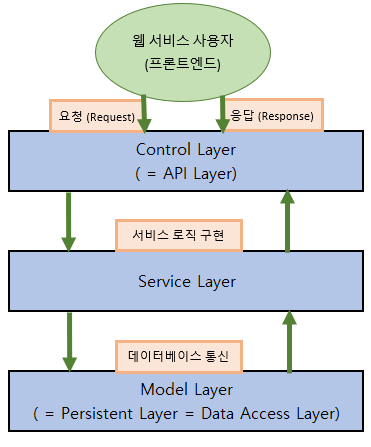

## 22.02.26
* Express와 Mongodb로 유저 API 만들기


### 1) 3계층 설계 (3-Layer architecture)
* [참고 블로그](https://velog.io/@hopsprings2/%EA%B2%AC%EA%B3%A0%ED%95%9C-node.js-%ED%94%84%EB%A1%9C%EC%A0%9D%ED%8A%B8-%EC%95%84%ED%82%A4%ED%85%8D%EC%B3%90-%EC%84%A4%EA%B3%84%ED%95%98%EA%B8%B0)

* 3계층 구조



> 이미지 출처: 엘리스 AI 트랙


* 폴더 구조

```routers (=controllers), services, db```

<br>

### 2) API 설계

1. URI 엔드포인트 및 HTTP 메소드 정하기
    * ex) ```/user/register```
    * GET, POST, PUT, DELETE
2. 받을 데이터(주로 json) 형태와 보낼 데이터(주로 json) 형태를 정하고, schema 만들기
3. Router 코드 작성하기
    * req, res 표현이 쓰이는 곳이며, URI 엔드포인트와 HTTP 메소드도 이 파일에서 작성된다.
4. Service 코드 작성하기
    * 이 서비스 층에서 사용할 모델 층의 함수(메소드)를 정해야 한다.
5. Model 코드 작성하기